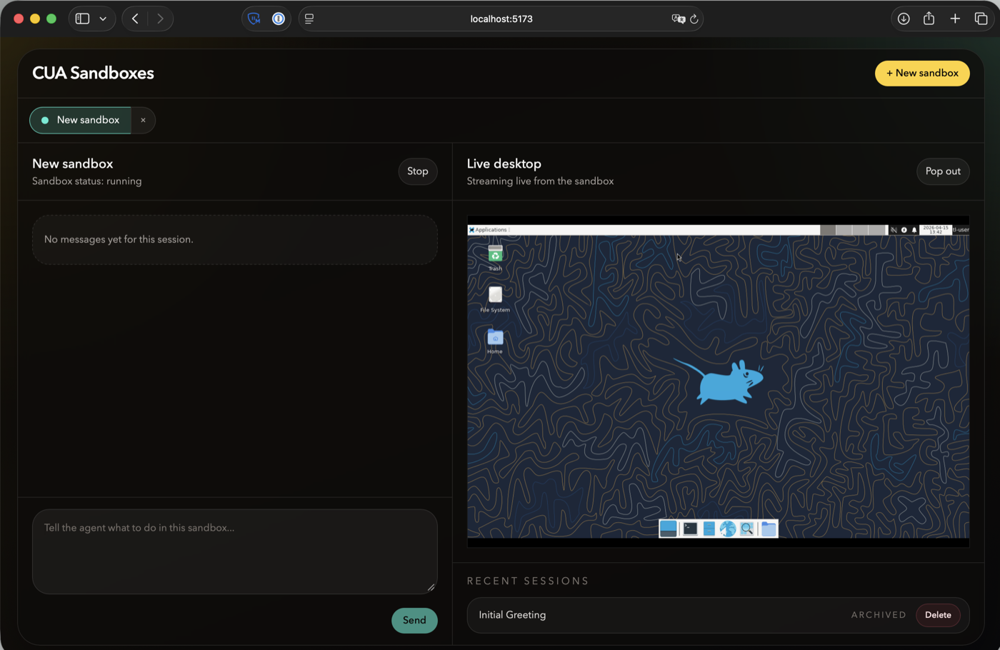

# Computer Use Demo

A simple multi-sandbox Computer Use Agent web app built with TypeScript.

It provides:

- A chat-first UI on the left
- A live interactive desktop on the right
- Multiple sandboxes managed with tabs
- Archived sessions with persisted chat history
- Simple multi-user isolation without login, using a per-browser cookie
- Gemini support with OpenAI fallback



Live demo: [Tensorlake Computer Use Sandboxes](https://8080-f03mblpmqsvs913d5hgx6.sandbox.tensorlake.ai/)

## What It Uses

- `apps/web`: React 19 + Vite
- `apps/server`: Fastify + SQLite + Tensorlake + Gemini/OpenAI provider integration
- `packages/contracts`: shared Zod schemas and TypeScript types
- Tensorlake sandboxes for the remote desktop
- noVNC for low-latency live streaming and interaction

## Current Model Selection

The backend supports two CUA providers:

- Gemini: `gemini-3-flash-preview`
- OpenAI fallback: `gpt-5.4`

Provider selection is automatic:

- If `GEMINI_KEY` is present, Gemini is preferred for new sessions
- If only `OPENAI_KEY` is present, OpenAI is used
- At least one of those keys must be configured

## Multi-User Behavior

This project does not have login.

Instead, the backend issues a unique `vnc_cua_visitor` cookie on first visit and scopes all sessions to that cookie. That means:

- Each browser gets its own list of active and archived sandboxes
- SSE updates are filtered per visitor
- Live VNC and input sockets are scoped to the visitor that owns the session

## Project Structure

- [apps/web](/Users/bkolobara/dev/vnc-cua/apps/web)
- [apps/server](/Users/bkolobara/dev/vnc-cua/apps/server)
- [packages/contracts](/Users/bkolobara/dev/vnc-cua/packages/contracts)

## Requirements

- Node.js 20+
- `corepack` / `pnpm`
- Tensorlake credentials
- A Gemini or OpenAI API key

The server uses the published `tensorlake` npm package.

## Getting Started

1. Install dependencies:

```bash
corepack pnpm install
```

2. Create your local env file:

```bash
cp .env.example .env
```

3. Fill in the required values in `.env`

4. Start the app:

```bash
corepack pnpm dev
```

5. Open:

- Web UI: [http://127.0.0.1:5173](http://127.0.0.1:5173)
- API server: [http://127.0.0.1:3000](http://127.0.0.1:3000)

In development, Vite proxies `/api` and websocket traffic to the Fastify server.

## Configuration

The root `.env` file supports these variables:

| Variable | Required | Description |
| --- | --- | --- |
| `HOST` | No | Fastify bind host. Defaults to `127.0.0.1`. |
| `PORT` | No | Fastify port. Defaults to `3000`. |
| `GEMINI_KEY` | Conditionally | Gemini API key. Preferred when present. |
| `OPENAI_KEY` | Conditionally | OpenAI API key. Used when Gemini is not configured. |
| `TENSORLAKE_API_KEY` | Yes | Tensorlake API key. |
| `TENSORLAKE_ORG_ID` | Yes | Tensorlake organization id. |
| `TENSORLAKE_PROJECT_ID` | No | Tensorlake project id. |
| `TENSORLAKE_API_URL` | No | Override for the Tensorlake API base URL. |
| `APP_DB_PATH` | No | SQLite database path, relative to the repo root. Defaults to `./data/cua.sqlite`. |

Notes:

- `GEMINI_KEY` or `OPENAI_KEY` must be set
- If both are set, Gemini is preferred for new sessions
- Screenshots are stored alongside the database under a sibling `screenshots/` directory

## How It Works

Each chat session owns one Tensorlake sandbox.

When a session is created, the backend:

- starts a sandbox using `tensorlake/ubuntu-vnc`
- connects to the desktop
- waits for the desktop to boot
- captures an initial screenshot
- exposes a live VNC stream to the browser

When you send a prompt:

- the backend sends the prompt to the configured CUA provider
- provider actions are mapped to Tensorlake desktop actions
- the backend captures updated screenshots for the agent loop
- assistant output and intermediate status messages are stored in SQLite and streamed to the UI

## UI Behavior

- Active sandboxes appear as tabs
- Archived sessions remain visible and can be permanently deleted
- The right side shows a live desktop when available, or the last screenshot for archived sessions
- The desktop can be popped into a larger overlay for easier interaction
- While a sandbox is still starting, the UI shows `Sandbox booting`

## Persistence

The app stores:

- session metadata in SQLite
- chat history in SQLite
- last screenshots as PNG files on disk

This keeps archived sessions lightweight while still showing the last known desktop state.

## Scripts

From the repo root:

```bash
corepack pnpm dev
corepack pnpm build
corepack pnpm test
corepack pnpm typecheck
```

Package-specific scripts are available in:

- [apps/server/package.json](/Users/bkolobara/dev/vnc-cua/apps/server/package.json)
- [apps/web/package.json](/Users/bkolobara/dev/vnc-cua/apps/web/package.json)
